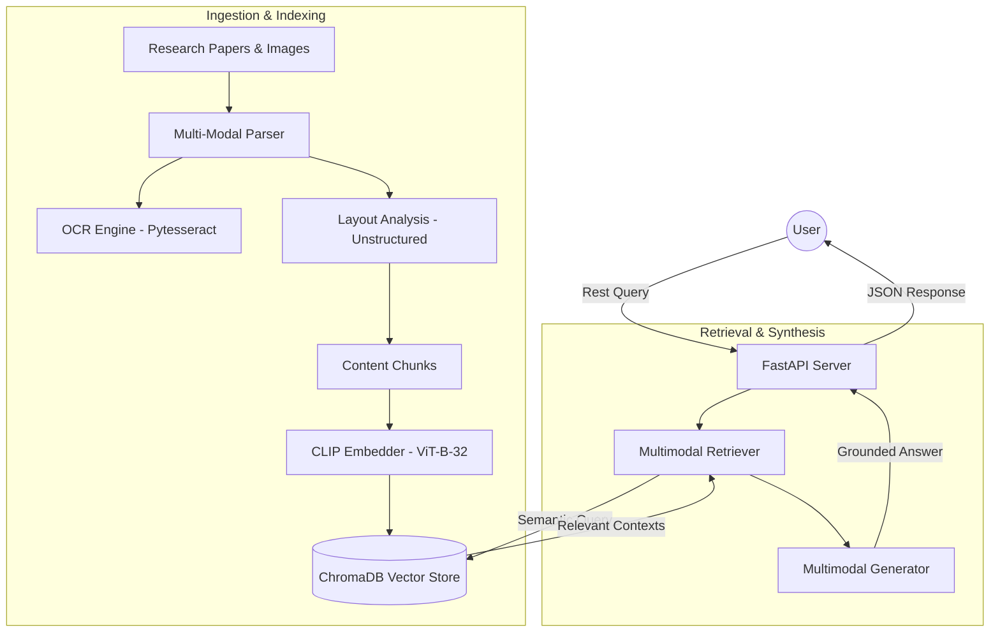

# 🏗️ System Architecture: Multimodal RAG

This document provides a technical deep-dive into the architectural design and data orchestration of the Multimodal RAG system.

## 🌟 Architectural Philosophy
The system is built on a **Decoupled Pipeline Architecture**, separating the heavy-lifting of ingestion and indexing from the latency-sensitive retrieval and generation phases. This ensures scalability and modularity.

---

## 🗺️ System Workflow Diagram

---

## 🛠️ Component Deep-Dive

### 1. Data Ingestion (The "Harvesting" Stage)
-   **PDF Parsing**: Leveraging `PyMuPDF` and `unstructured` to handle complex multi-column academic layouts.
-   **OCR Integration**: Standalone and nested images are passed through a `pytesseract` pipeline to extract technical logic (formulas, labels).
-   **Table Extraction**: Structured data is identified and serialized, ensuring that quantitative information isn't lost during chunking.

### 2. Multimodal Embedding (Shared Semantic Space)
-   **CLIP (Contrastive Language-Image Pre-training)**: We use the `clip-ViT-B-32` model to map both text chunks and images into a shared **512-dimensional vector space**. 
-   **Why CLIP?**: Unlike traditional text-only embedding models, CLIP understands the relationship between concepts (e.g., the word "Transformer" and a diagram of an encoder-decoder stack).

### 3. Vector Storage & Indexing
-   **ChromaDB**: A high-performance, developer-friendly vector database. 
-   **Hybrid Indexing**: We store rich metadata (source PDF, page number, content type, OCR text) alongside the vectors to enable precise citation and visual grounding.

### 4. Retrieval Strategy
-   **Cross-Modal Search**: The `MultimodalRetriever` converts user queries into CLIP space to find the most semantically relevant text *and* images simultaneously.
-   **Similarity Scores**: We use **cosine similarity** to rank and retrieve the top `N` most relevant contexts.

### 5. Generation & Visual Grounding
-   **Groq Llama-4-Scout**: We utilize Groq's low-latency inference engine to run `meta-llama/llama-4-scout-17b-16e-instruct`.
-   **System Persona**: A specialized "AI Research Assistant" prompt guides the model to synthesize information and cite sources with page-level accuracy.

---

## 🔧 Core Technology Stack
| Layer | Tech Choice | Rationale |
| :--- | :--- | :--- |
| **API** | FastAPI | High performance, asynchronous, and easy schema validation. |
| **Embedder** | Sentence-Transformers (CLIP) | Industry-standard for multimodal semantic alignment. |
| **Vector DB** | ChromaDB | Persistent, scalable, and LangChain-compatible. |
| **VLM/LLM** | Groq (Llama-4-Scout) | Best-in-class technical reasoning with sub-second latency. |
| **OCR** | Pytesseract / EasyOCR | Robust engine for technical diagram analysis. |
