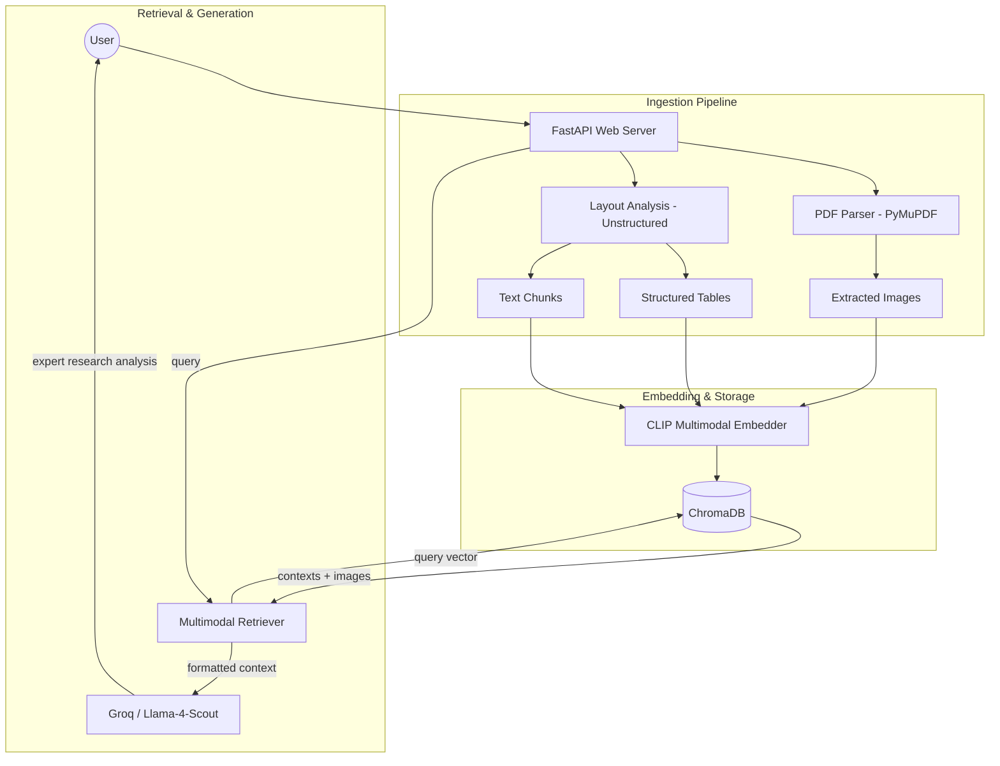

# System Architecture: Multimodal RAG

This document details the architectural design and data flow of the Multimodal RAG system.

## Overview
The system is designed as a decoupled pipeline capable of processing text, tables, and images from complex PDF documents. It leverages a shared vector space (CLIP) to allow text-based queries to retrieve both textual and visual information.

## Component Diagram

## Data Flow
1.  **Ingestion**: Files in `sample_documents/` (10 ML papers) are parsed. `unstructured` handles layout and table extraction, while OCR is run on images to extract textual logic.
2.  **Indexing**: Each element (text chunk, table, image) is converted into a vector using CLIP. These are stored in a persistent LangChain-wrapped ChromaDB instance.
3.  **Retrieval**: Queries are encoded into CLIP space. ChromaDB returns relevant text and images.
4.  **Generation**: Retrieved text and Image OCR are passed to **Llama-4-Scout** via Groq. A specialized "AI Researcher" prompt ensures responses are technically grounded and cite sources.

## Technology Choices
- **CLIP (sentence-transformers)**: Bridges the gap between text and visual concepts in a shared mathematical space.
- **LangChain**: Orchestrates the complex multimodal retrieval flow and prompt management.
- **Groq & Llama-4-Scout**: Provides lightning-fast, expert-level technical reasoning over research context.
