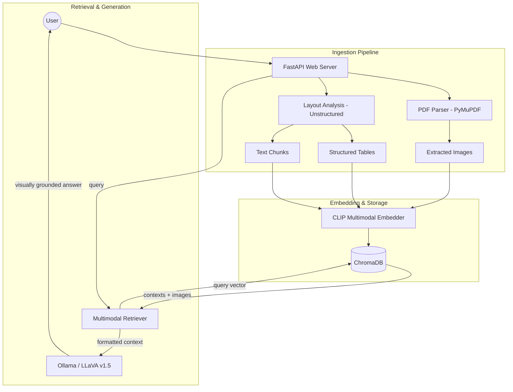

# System Architecture: Multimodal RAG

This document details the architectural design and data flow of the Multimodal RAG system.

## Overview
The system is designed as a decoupled pipeline capable of processing text, tables, and images from complex PDF documents. It leverages a shared vector space (CLIP) to allow text-based queries to retrieve both textual and visual information.

## Component Diagram

## Data Flow
1.  **Ingestion**: Files in `sample_documents/` are parsed. `unstructured` handles layout and table extraction, while `PyMuPDF` extracts high-resolution images.
2.  **Indexing**: Each element (text chunk, table, image) is converted into a 512-dimensional vector using a CLIP model. These are stored in a persistent local ChromaDB instance with rich metadata.
3.  **Retrieval**: When a user queries, the text is encoded into the same CLIP space. ChromaDB returns the most similar items (regardless of modality).
4.  **Generation**: The retrieved text and raw images (returned to their original file paths) are passed to the LLaVA model. The prompt instructs the model to cite sources and specific visual elements.

## Technology Choices
- **CLIP (sentence-transformers)**: Provides the critical "shared space" feature where words like "chart" or "red car" share vector proximity with actual images of those things.
- **Unstructured**: Essential for "real-world" documents where tables and columns would otherwise be lost in a raw text dump.
- **Ollama/LLaVA**: Provides state-of-the-art local multimodal reasoning without requiring expensive cloud GPUs or API keys.
