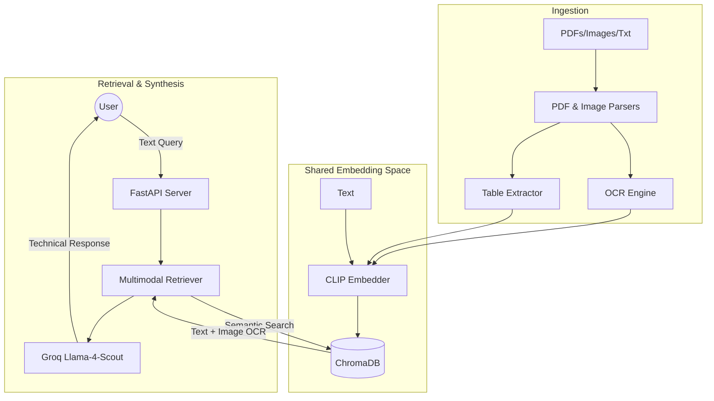

# 📚 Multimodal RAG System for Research Analysis

A heavy-duty Retrieval-Augmented Generation (RAG) system engineered to synthesize complex information from text, structured tables, and diagrams. Optimized for analyzing seminal ML/AI research papers, this system uses a multimodal embedding space to bridge the gap between visual and textual data.

## 🚀 Key Features

-   **🔬 Research-First Design**: Tailored to analyze dense scientific papers like *Attention Is All You Need*, *Adam*, and *ResNet*.
-   **🖼️ Multimodal Intelligence**: Uses **CLIP (ViT-B-32)** to place text and images in a shared semantic space, enabling cross-modal retrieval.
-   **⚡ Lightning Inference**: Powered by **Groq** and **Llama-4-Scout** for sub-second, technically grounded reasoning.
-   **📝 OCR & Layout Analysis**: Employs `unstructured` and `pytesseract` to extract logic from diagrams and preserve table structures.
-   **🐳 Dockerized Deployment**: Fully containerized for consistent deployment across environments.

---

## 🏗️ System Workflow



---

## 🛠️ Setup & Installation

### 1. Prerequisites
- Python 3.10+ or **Docker**
- **Groq API Key**: Obtain from [Groq Console](https://console.groq.com/).

### 2. Local Setup (Recommended for Dev)
```bash
# Clone and enter the repository
git clone <your-repo-url>
cd <repo-name>

# Set up virtual environment
python -m venv .venv
.\.venv\Scripts\activate

# Install dependencies
pip install -r requirements.txt
```

### 3. Docker Deployment (Recommended for Production)
```bash
# Build and run the system
docker-compose up --build
```

---

## 🖥️ API Usage

### ⚙️ 1. Ingestion
Trigger the ingestion of all files in the `sample_documents/` folder.
- **Endpoint**: `POST /ingest`
- **Response**:
```json
{
  "status": "success",
  "message": "Ingestion started for 14 files.",
  "files": ["Attention Is All You Need.pdf", "transformer_diagram.png", "research_notes.txt"]
}
```

### 🔍 2. Multimodal Query
Ask technical questions about your research documents.
- **Endpoint**: `POST /query`
- **Request Body**:
```json
{
  "query": "Explain the Transformer multi-head attention mechanism with citations.",
  "n_results": 5
}
```
- **Example Response**:
```json
{
  "answer": "Multi-head attention allows the model to jointly attend to information from different representation subspaces at different positions. As shown in Figure 2 of 'Attention Is All You Need' (Page 4), it consists of several attention layers running in parallel...",
  "sources": [
    {
      "document_id": "Attention Is All You Need.pdf",
      "page_number": 4,
      "content_type": "image",
      "image_path": "./data/processed/Attention_Is_All_You_Need_p4_img1.png"
    },
    {
      "document_id": "Attention Is All You Need.pdf",
      "page_number": 4,
      "content_type": "text"
    }
  ]
}
```

---

## 🧪 Multimodal Embeddings
The system maps different modalities into a 512-dimensional vector space:
- **Text**: Technical descriptions and OCR results.
- **Images**: Diagrams, charts, and architectural drawings.
- **Tables**: Serialized table structures for quantitative reasoning.

Use `evaluation.ipynb` to measure the **Hit Rate @ 1** and **MRR** across your document set.

---

## 📂 Project Structure
- `src/api`: FastAPI endpoints.
- `src/ingestion`: Data processing pipeline (PDF, OCR, Tables).
- `src/embeddings`: CLIP model integration.
- `src/retrieval`: Cross-modal semantic search logic.
- `src/generation`: Groq-based technical response generation.
- `tests/`: Automated unit and integration suites.
